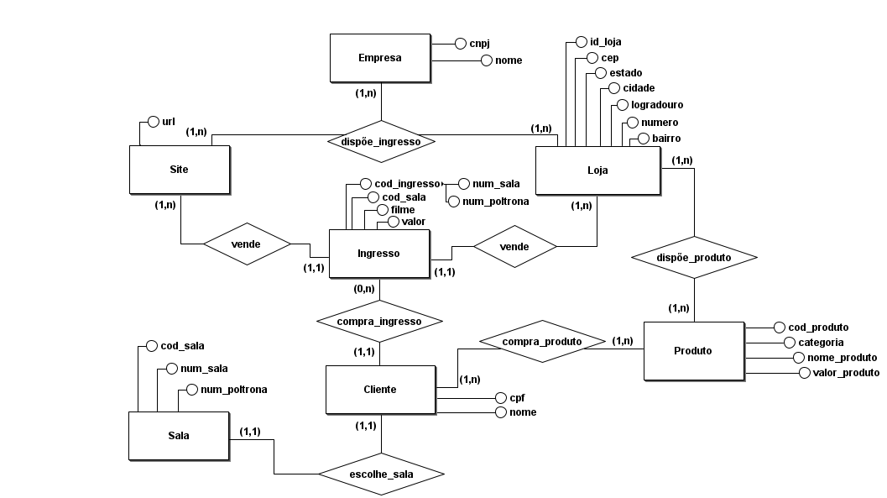
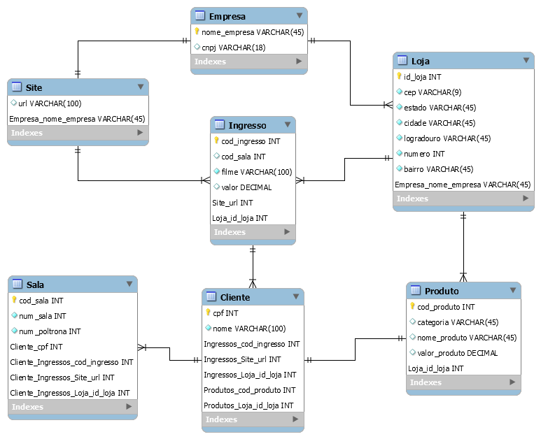

<p align="center">
  <a href="https://github.com/github_username/repo_name">
    
  </a>


  <h3 align="center">BANCO DE DADOS - REDE CINESYSTEM CINEMAS</h3>

  <p align="center">
    ATIVIDADE DE CRIAÇÃO DE BANCO DE DADOS SENAC DF
Aluno: Carlos André Alves Bezerra
Projeto da Empresa: CINESYSTEM   

  

<details open="open">
  <summary><h2 style="display: inline-block">Conteúdo</h2></summary>
  <ol>
    <li><a href="#minimundo">Minimundo</a></li>
    <li><a href="#Modelo Entidade Relacionamento (MER)">Modelo Conceitual</a></li>
    <li><a href="#Modelo Lógico">Modelo Lógico </a></li>
    <li><a href="#Modelo Físico">Modelo Físico</a></li>
    <li><a href="#contatos">Contatos</a></li>
  </ol>


## Minimundo

<p>A REDE CINESYSTEM CINEMAS proporciona a você o que há de melhor em experiência cinematográfica. Desde 2003, tornou-se uma das principais exibidoras do país e vem investindo ano a ano na qualidade do seu atendimento e em inovações tecnológicas de ponta, sendo uma das principais precursoras da digitalização no Brasil, com os primeiros complexos 100% digitais, e a única da América Latina com um cinema com o sistema Barco Innovation Center, que une Lobby Domination (comunicação integrada em todas as TVs e videowalls) e projeção a laser em 100% das salas, isso permite que os filmes sejam vistos com mais clareza e com imagens ainda mais nítidas.</p>

<p>Hoje, a Rede possui 160 salas em operação, distribuídas em dez estados brasileiros, do Pará ao Rio Grande do Sul passando por Maranhão, Pernambuco, Alagoas, Espírito Santo, Rio de Janeiro, São Paulo, Paraná e Santa Catarina.</p>

<p>A Cinesystem é também a única rede de cinemas do Brasil com cinemas autoatendimento, onde o cliente compra os ingressos em estações de vendas com monitores touch screen e se serve sozinho no variado mix de produtos oferecidos nas lojas, ou pode também comprar pelo site. Para o cliente é mais liberdade de escolha e ele faz as suas compras no seu tempo.</p>


### Modelo Entidade Relacionamento (MER)





<h3>Modelo Lógico</h3>




### Modelo Físico

Utilizando alguns comandos: DDL, DML, DQL.


```sh
/* CRIANDO UM BANCO DE DADO*/
CREATE DATABASE IF NOT EXISTS cinesystem;
 
 /* UTILIZANDO/SELECIONANDO UM BANCO DE DADO CRIADO */
USE cinesystem;

/* CRIANDO TABELAS */
CREATE TABLE IF NOT EXISTS tbl_empresa(
cnpj VARCHAR(18) PRIMARY KEY NOT NULL,
nome VARCHAR(45)
);

/*ADICIONANDO COLUNAS*/
ALTER TABLE tbl_empresa;

SHOW COLUMNS FROM tbl_empresa;

CREATE TABLE IF NOT EXISTS tbl_site(
url VARCHAR(100)
);

/*ADICIONANDO COLUNAS*/
ALTER TABLE tbl_site;

SHOW COLUMNS FROM tbl_site;

CREATE TABLE IF NOT EXISTS tbl_loja(
id_loja INT NOT NULL PRIMARY KEY,
cepRCHAR VARCHAR(9),
estado VARCHAR(45),
cidade VARCHAR(45),
logradouro VARCHAR(45),
numero INT,
bairro VARCHAR(45)
);

/*ADICIONANDO COLUNAS*/
ALTER TABLE tbl_loja;

SHOW COLUMNS FROM tbl_loja;

CREATE TABLE IF NOT EXISTS tbl_ingresso(
cod_ingresso INT NOT NULL PRIMARY KEY AUTO_INCREMENT,
cod_sala INT,
filme VARCHAR(100),
valor DECIMAL
);

/*ADICIONANDO COLUNAS*/
ALTER TABLE tbl_ingresso;

SHOW COLUMNS FROM tbl_ingresso;

CREATE TABLE IF NOT EXISTS tbl_produto(
cod_produto INT NOT NULL PRIMARY KEY AUTO_INCREMENT,
categoria VARCHAR(45),
nome_produto VARCHAR(45),
valor INT
);

/*ADICIONANDO COLUNAS*/
ALTER TABLE tbl_produto;

SHOW COLUMNS FROM tbl_produto;

CREATE TABLE IF NOT EXISTS tbl_cliente(
cpf INT NOT NULL PRIMARY KEY,
nome VARCHAR(100) NOT NULL
);

SHOW COLUMNS FROM tbl_cliente;

CREATE TABLE IF NOT EXISTS tbl_sala(
cod_sala INT NOT NULL PRIMARY KEY,
num_sala INT NOT NULL,
poltrona INT NOT NULL
);

/*ADICIONANDO COLUNAS*/
ALTER TABLE tbl_sala;
SHOW COLUMNS FROM tbl_sala;

```


## Contatos

André Alves: [andrealves-tec@hotmail.com](andrealves-tec@hotmail.com)

Linkedin: [https://www.linkedin.com/in/andrealves8/](https://www.linkedin.com/in/andrealves8/)

Linkedin: [https://github.com/andrealves8](https://github.com/andrealves8)

# Projeto-ABD2-Senac-Cine-System-
# Projeto-ABD2-Senac-Cine-System-
# Projeto-ABD2-Senac-Cine-System-
# Projeto-ADB-CINESYSTEM
# ADB-SENAC-CineSystem-
